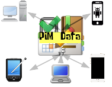
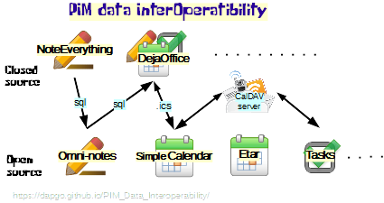

 

PIM Data Inter-Operability
==========
Solutions to improve the Interoperability between data form different formats and PIM apps (personal information managers)

# Introduction

The aim of this project is to research, document and develop solutions against the loss of access to information due the fact that 
there are many risks for our information. And information and data his too important to expose to loss.

# Reasons, potential risks and current scenario
1. Lack of standards on file format (sqlite, json,....)
2. Lack of standards on data estructure (different fields, type, tables)
3. Lack of Import/export functions (many apps cannot even export to CSV)
4. Cycle life of Commercial apps/closed source (years after an app is abandoned, hardware can be incompatible with our old software)
5. Change of Platform, software maybe is not available for our new platform (iOS, Android, Linux, Windows, MacOS, Blackberry, ....)
6. Existance of non IT skilled users, probably they are not aware of these risks and will not decide a software thinking in interoperability

 

# Support/Covered software/ Data formats
- [x] Noteeverything (Memos/Notes) (de.softxperience.android.noteeverything) (Android-Commercial)
- [x] Omni-notes (Memos/Notes,Checklist) (it.feio.android.omninotes.foss) (Android-Opensource/desktop multiplatform)
- [x] DejaOffice (only Memos/Notes) (com.companionlink.clusbsync) (Android,iOS,..-Commercial)
- [x] Simple Calendar (Android-Opensource)(com.simplemobiletools.calendar) through import/export ICS v2.0

# Developments/Solutions
See section in wiki
- [x] Based in SQL -Scripts and queries to migrate information from/to Noteeverything/Omni-notes/DejaMemos
- [ ] (in progress) Contact developers and ask for standard format and interoperatibility features
- [ ] (in progress) Documentation about tables, fields, relations,etc
- [ ] (PENDING TODO) Script to extract Calendar events from SQLlite db to ICS format
- [ ] (PENDING TODO) Script to extract Task events from SQLlite db to ICS(TODO) format
- [ ] (PENDING TODO) Script to extract Tasks/Notes events from SQLlite db to JSON format
- [ ] (PENDING TODO) Script to extract Notes/Tasks from "Org mode" file format to ICS(TODO) or any JSON format
- [ ] (thinking about) Apps (android, pc) to automate the conversion from a format to another

# Apps/data not fully supported or planned to support
See section in wiki
1. Tasks (Android-Opensource) (org.tasks)
    Data in JSON
2. etar (Android v5-Opensource)
3. orgzly(Android-Opensource)
4. Notes for Firefox (Addon/Android-Opensource)
5. your request???

(if you think other apps should be included in the list, raise an issue including reasons, and as much technical information as possible)
    
    

# Donations

https://www.paypal.me/dapgo

Accepted and specially if you request help with different apps/data format ;)

Furthermore, I think that a symbolic donation is a good way to receive feedback from users and motivate the developer

