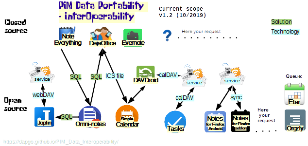

 

PIM Data Portability / Inter-Operability
==========
What is: An opensource solutions to make possible the data portability/Interoperability between different PIM apps (Personal Information Managers). Specifically the project offers procedures and scripts to convert/translate data from a source app to a target app.

Definition: interoperability is "The capability to communicate, execute programs, or transfer data among various functional units in a manner that requires the user to have little or no knowledge of the unique characteristics of those units"

[definition at wikipedia](https://en.wikipedia.org/wiki/Interoperability#Software)

# Introduction

The aim of this project is to research, document and develop solutions against the loss of access to information due the fact that 
there are many risks for our information. And information and data his too important to expose to loss.

# Why/Reasons:
1. Lack of a single standard on file format (sqlite, json,....)
2. Lack of standards on data estructure (different fields, type, tables...)
3. Lack of Import/export functions (many apps cannot even export to CSV)
4. Cycle life of Commercial apps/closed source (years after an app is abandoned, hardware can be incompatible with our old software)
5. Change of Platform, software maybe is not available for our new platform (iOS, Android, Linux, Windows, MacOS, Blackberry, ....)
6. Existance of non IT skilled users, probably they are not aware of these risks and will not decide a software thinking in interoperability

 
 
 # Solutions , alternatives:
 
 Available SQL scripts at project github repository, [folder /SQLite scripts/](https://github.com/dapgo/PIM_Data_Interoperability/tree/master/SQLite%20scripts)
 
 [More information at GitHub webpage:](https://dapgo.github.io/PIM_Data_Interoperability/)
 
 [More information at GitHub wiki:](https://github.com/dapgo/PIM_Data_Interoperability/wiki)
